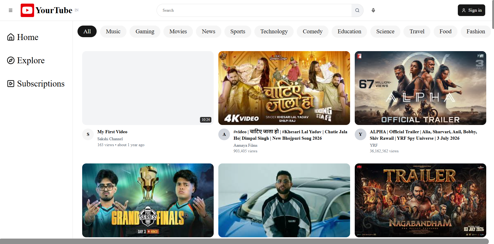
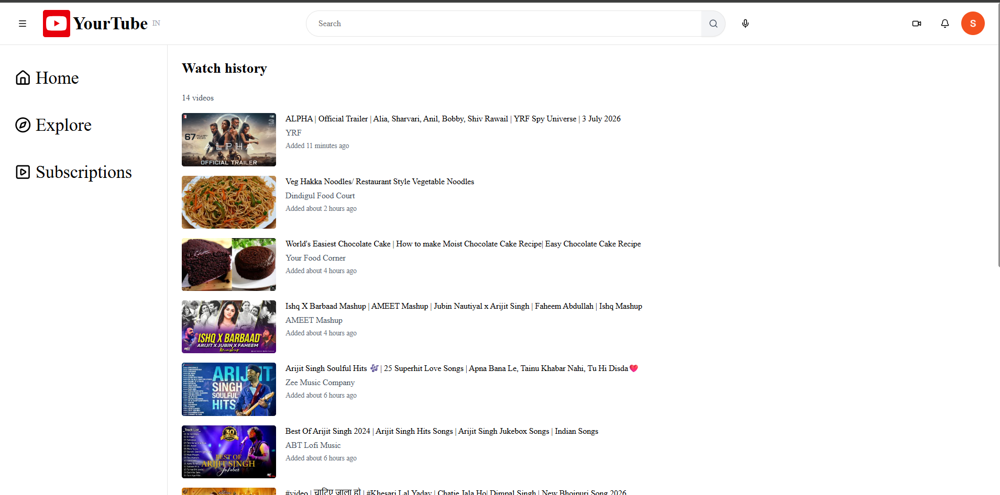
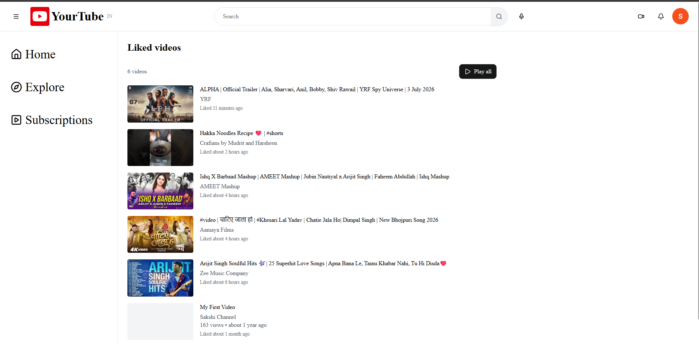
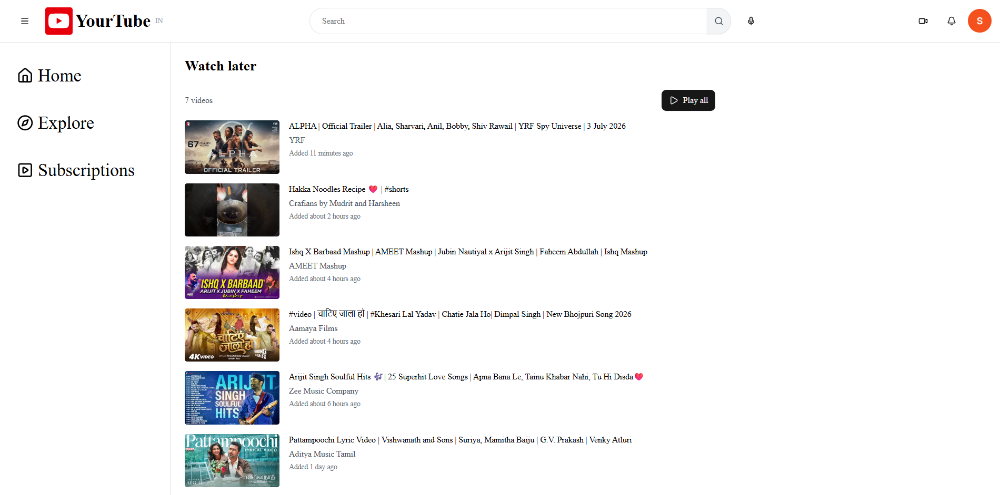

# 🎥 YouTube Clone

A full-stack video sharing platform inspired by YouTube, built using Next.js, React, Node.js, Express.js, MongoDB, and Firebase Authentication.

## 🚀 Live Demo

🌐 https://youtube-clone-videoverse.vercel.app

## ✨ Features

- User Authentication (Google Sign-In)
- Video Upload & Playback
- Search Videos
- Search Suggestions
- Like Videos
- Comments System
- Watch Later Playlist
- Watch History
- Channel Creation
- Subscribe Functionality
- Responsive Design
- Modern YouTube-inspired UI

## 🛠️ Tech Stack

### Frontend
- Next.js
- React.js
- TypeScript
- Tailwind CSS
- ShadCN UI

### Backend
- Node.js
- Express.js
- MongoDB
- Firebase Authentication

## 📸 Screenshots

  
  

  
  

## 📂 Installation

bash
git clone https://github.com/sakshispatil36/Youtube-Clone.git
cd Youtube-Clone
npm install
npm run dev
